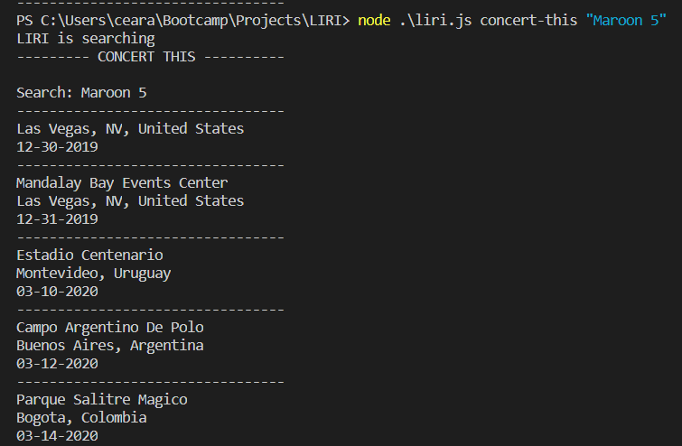
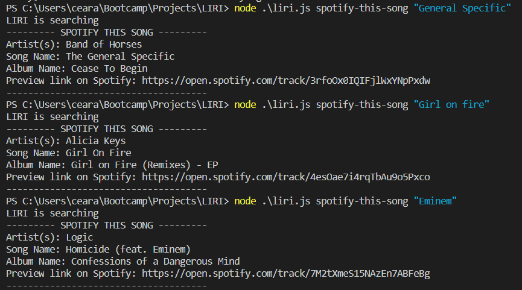

# LIRI
LIRI is an app designed to search Spotify for songs, Bands in Town for concerts, and OMDB for movies.

## To run the LIRI App

The LIRI App allows the user to search for information on the following:
* Upcoming concert venue for any selected Artist
* Information on any movie of the user's choosing
* Information on any song of the user's choosing

## Built With the following packages

To retrieve the data that will power this app, requests are sent using the `axios` package to the Bands in Town, Spotify and OMDB APIs. Additionally, packages for Moment and DotEnv are also included.

   * [Node-Spotify-API](https://www.npmjs.com/package/node-spotify-api)

   * [Axios](https://www.npmjs.com/package/axios) - Axios is used to grab data from the [OMDB API](http://www.omdbapi.com) and the [Bands In Town API](http://www.artists.bandsintown.com/bandsintown-api)

   * [Moment](https://www.npmjs.com/package/moment)

   * [DotEnv](https://www.npmjs.com/package/dotenv)

### User Controls -  Using the following comands, LIRI will retrieve the appropriate information and display it for the user.

   * `concert-this`

   * `spotify-this-song`

   * `movie-this`

   * `do-what-it-says`

  #### `concert-this <artist name>` - When running this command, concert venue information is displayed for desired artist
   *  
  

  #### `spotify-this-song` - When running this command, Spotify information is displayed for desired song
   

   #### `movie-this` - When running this command, movie information is displayed
  

   #### `do-what-says` - When running this command, LIRI reads random.txt and executes the command accordingly
  
